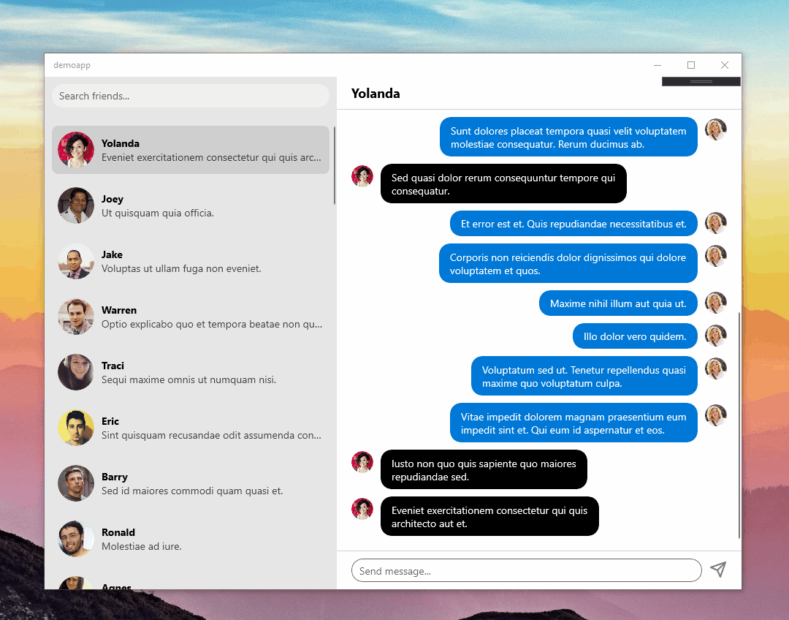

# Chat Demo using React Native Windows

> Running on Windows 10

This has been created for [the following video](https://youtu.be/lyxvDVdl390).

What matters is how RNW can be used given a simple use case.

To run the example, install the dependencies and use `npx react-native run-windows`.

It is recommended to follow the [official documentation first](https://microsoft.github.io/react-native-windows).
